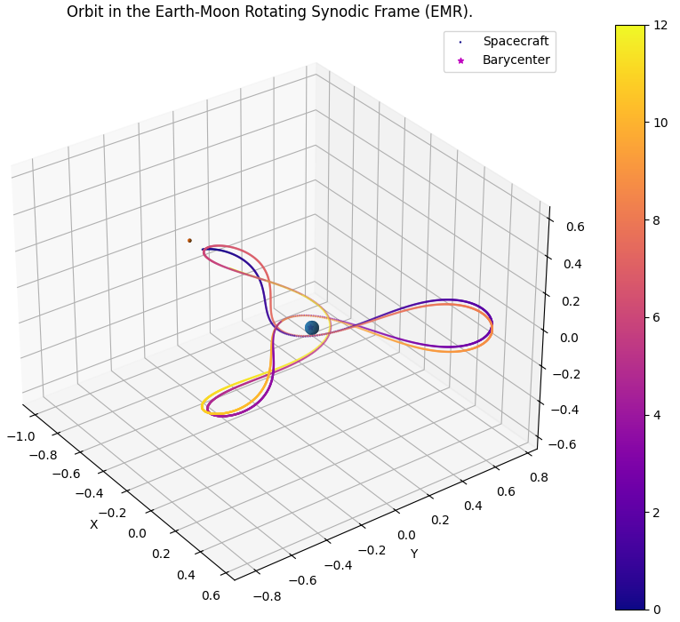
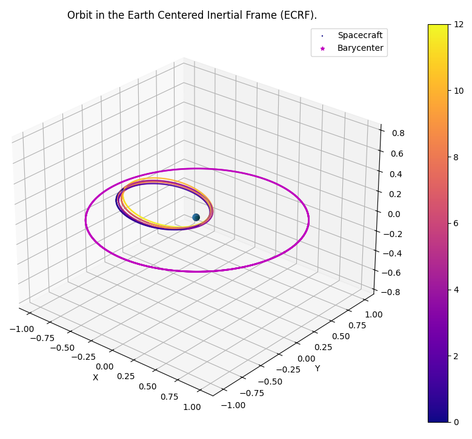

# Solar-Sail Trajectories in the Earth-Moon 3-Body Problem
Senior design project investigating solar sail trajectory design of Earth-Moon system to measure some things...
This repository is my senior design project investigating the trajectory design of a solar sailing mission for collecting heliophysics data. The main file, `simulation.py` takes in an inital state vector and integrates the initial conditions with the SciPy integration library. It will eventually include control laws for the solar sail to achieve a desired final orbit. You can select the integrator, the reference frame of integration, and the reference frame of the plotted orbit.

It also includes the file `state_library.py`, which is a dictionary of interesting inital states in the E-M CR3BP. The common 3:1 resonance orbit is shown in the Synodic and Earth Centered Inertial frames below using it's name in the state library, 'Turbine'.

